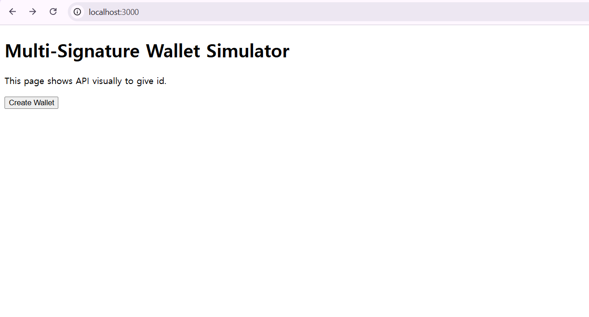
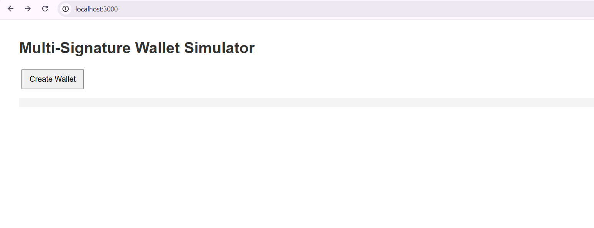
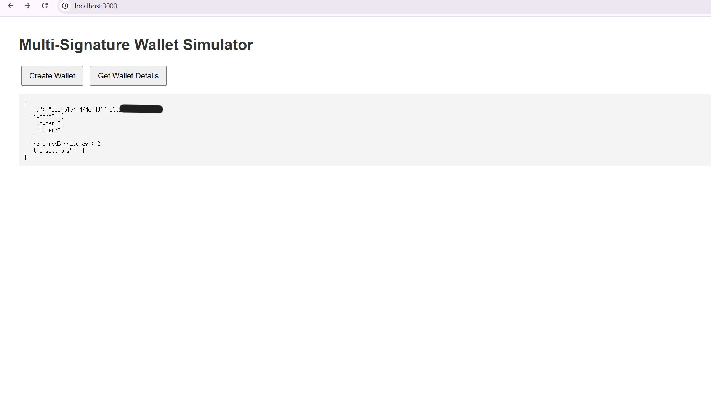
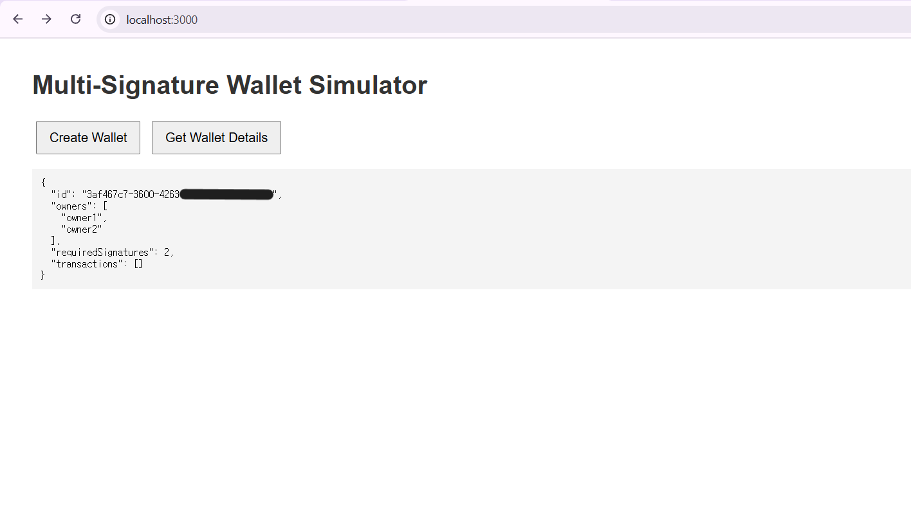
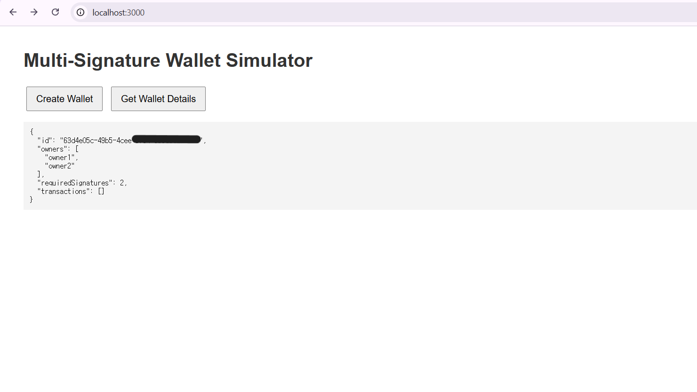

# Multi-Signature Wallet Simulator

A simple simulation of a multi-signature wallet built with **TypeScript** and Express. This project demonstrates wallet creation, transaction processing, and digital signature approval.

## Features

- Create a wallet with multiple owners.
- Create and approve transactions.
- Simple web interface for testing.

## Screenshot


**I know this is worst design but just checking step**


**So I changed it more looks better (in my opinion)**


**Actually I made this buttons and some front-end to make it easier to get API and POST**


**Good, they gave me different wallet id**


**I checked it for my last step yeah**

## Installation

1. **Clone the repository:**

   ```
   git clone https://github.com/aAnnChangSal/multi-sig-wallet.git
   cd multi-sig-wallet

2. **Install dependencies:**

    ```
    npm install

3. **Run the server:**

    ```
    npm start

> The server will run on http://localhost:3000

**API Endpoints**
- **POST /wallet**
  Create a new wallet.
  Request Body:

  ```
  {
  "owners": ["owner1", "owner2"],
  "requiredSignatures": 2
  }

  - **GET /wallet/:id**
  Retrieve wallet details by ID.

  - **POST /wallet/transaction**
  Create a new transaction.
  Request Body:

  ```
  {
  "walletId": "wallet-id",
  "amount": 100,
  "toAddress": "recipientAddress"
  }

   - **PUT /wallet/transaction/:id/approve**
  Approve a transaction.
  Request Body:

  ```
  {
  "ownerKey": "owner1"
  }


## Web Interface
Open http://localhost:3000 in your browser to use the simple web interface for creating and retrieving wallet details

## Testing
Run tests with:

```
npm test

## License
Licensed under the ISC License.
